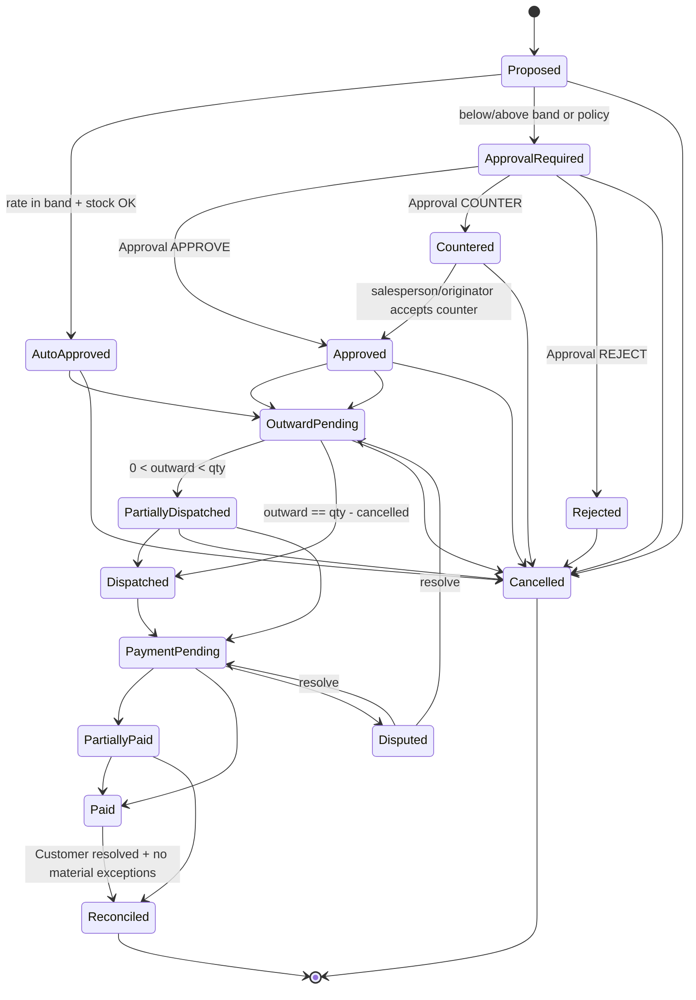

# Fresko Universe — Phase 1 Blueprint (FINAL)
**Chief of Staff decision · 15 Sep 2026**  
**Anubhav approved 15 Sep 2026** with D1, D3, D4, D5, D6, D10 locked (see DECISIONS.md). Frappe/ERPNext v15 remains PROVISIONAL until pinned.  
**Scope:** Fresko Container + Fresko Deal (+ minimal companions required for acceptance)  
**Stack assumption:** Frappe v15 + ERPNext v15 (Serial and Batch Bundle)  
**Repo:** none found (GitHub not connected). Greenfield `fresko_universe` app.

This document supersedes specialist drafts where they conflict. Specialists advise; this is the engineering decision.

---

## Chief decisions (locked for Phase 1 scaffold)

| ID | Decision |
|---|---|
| C1 | Custom DocTypes: **Fresko Container**, **Fresko Container Lot** (child), **Fresko Deal**, **Fresko Approval**, **Fresko Revision**, **Fresko Evidence** (minimal), **Fresko Exception** (minimal). |
| C2 | **No Sales Order / Delivery Note / Stock Entry on approve** in Phase 1. Soft commercial reservation only. SO timing remains Anubhav D1 for Phase 1.5+. |
| C3 | **Fresko Revision is mandatory** — Frappe `track_changes` alone is insufficient for approved commercial fields. |
| C4 | `approved_rate` / approved `qty` / lot / container / confirmed customer change **only** via Approval or Revision(+re-Approval) server methods — never Desk/API direct write. |
| C5 | Deal `status` transitions **server-validated only**; no free Status dropdown for ops roles. |
| C6 | Lot membership is schema-enforced: Deal.lot → Container Lot row on Deal.container. |
| C7 | Soft ATS at lot+container; **PROPOSED does not reduce ATS**; APPROVED/AUTO_APPROVED do; re-read ATS under transactional lock immediately before approval; never posts SLE. |
| C8 | Idempotency stubs now: unique `source_message_id`, unique `duplicate_fingerprint` (when set). WhatsApp ingest is out of scope but fields/uniqueness exist. |
| C9 | Unresolved buyer: Deal may reach APPROVED with `BUYER_UNRESOLVED` open; **block** RECONCILED / SO / party-ledger posting until Customer set. Never wipe `buyer_alias`. |
| C10 | **D4 locked:** COUNTERED requires salesperson/originator explicit accept before APPROVED. Approver wanting immediate different rate uses APPROVE with decision_rate. |

---

## A. Schema — Fresko Container

**Naming:** `CON-.YYYY.-.` · unique `(company, container_no)` · `track_changes=1` · not submittable in v1.

| fieldname | type | link/options | reqd | notes |
|---|---|---|---|---|
| naming_series | Select | CON-.YYYY.-. | 1 | |
| company | Link | Company | 1 | |
| container_no | Data | | 1 | Shipping/internal id |
| supplier | Link | Supplier | 1 | Partner |
| country_of_origin | Link | Country | 0 | |
| item | Link | Item | 1 | Primary produce; has_batch_no |
| arrival_date | Date | | 1 | |
| warehouse | Link | Warehouse | 0 | Cold store |
| inward_qty | Float | | 1 | Aggregate; must equal sum(lots) when lots present |
| uom | Link | UOM | 1 | |
| currency | Link | Currency | 1 | |
| landed_cost | Currency | | 0 | **Ops only — no GL** |
| status | Select | Draft/Expected/Arrived/In Cold Storage/Selling/Closing/Closed/Cancelled | 1 | Server transitions |
| closing_status | Select | Open/Ready to Close/Closed with Exceptions/Fully Reconciled/Cancelled | 1 | Fail-closed on material exceptions |
| lots | Table | Fresko Container Lot | 1* | *Required once Arrived+ |
| source_documents | Table | Fresko Container Source Document | 0 | |

### Child: Fresko Container Lot

| fieldname | type | reqd | notes |
|---|---|---|---|
| lot_no | Data | 1 | Commercial LOT; unique per container |
| batch | Link/Batch | 0 | ERPNext Batch when mapped |
| inward_qty | Float | 1 | Lot inward |
| uom | Link/UOM | 1 | |
| count_size | Data | 0 | |

### Child: Fresko Container Source Document
document_type, attachment, reference, content_hash, notes (as Frappe draft).

---

## B. Schema — Fresko Deal

**Naming:** `DEAL-.YYYY.-.` · unique `source_message_id` (nullable) · unique `duplicate_fingerprint` (nullable) · `track_changes=1`.

| fieldname | type | reqd | notes |
|---|---|---|---|
| company | Link/Company | 1 | From container |
| container | Link/Fresko Container | 1 | |
| customer | Link/Customer | 0 | Empty until resolved |
| buyer_alias | Data | 1 | **Immutable after insert** |
| item | Link/Item | 1 | |
| container_lot | Link / or Dynamic to child | 1 | Must belong to container |
| lot_no | Data | 1 | Copied/preserved commercial LOT |
| batch | Link/Batch | 0 | |
| count_size | Data | 0 | |
| qty | Float | 1 | Locked after approval except Revision |
| uom | Link/UOM | 1 | |
| proposed_rate | Currency | 1 | Frozen after leave Proposed |
| approved_rate | Currency | 0 | Approval path only |
| currency | Link/Currency | 1 | |
| amount | Currency | 0 | qty × (approved_rate or proposed_rate) |
| salesperson | Link/Sales Person | 0 | |
| salesperson_user | Link/User | 0 | |
| status | Select | 1 | State machine below |
| approval_required | Check | 0 | Rules engine |
| approval | Link/Fresko Approval | 0 | Latest material decision |
| source_message_id | Data | 0 | Immutable once set |
| duplicate_fingerprint | Data | 0 | Immutable once set; sha256(container\|alias\|lot\|qty\|rate\|day) |
| rate_floor / rate_ceiling | Currency | 0 | Snapshot at propose |
| cancel_reason | Small Text | 0 | Reqd on Cancelled |

**Fingerprint algorithm (locked):**  
`sha256(lower(trim(buyer_alias)) + "|" + container + "|" + lot_no + "|" + format(qty) + "|" + format(proposed_rate) + "|" + uom + "|" + YYYY-MM-DD)`  
Same fingerprint → attach Evidence + Exception `DUPLICATE_MESSAGE`, **never** second Deal.

---

## C. ERPNext entities linked

| Fresko | ERPNext |
|---|---|
| Container.company | Company |
| Container.supplier | Supplier |
| Container.item / Deal.item | Item (`has_batch_no=1`) |
| Container.warehouse | Warehouse |
| Container Lot.batch / Deal.batch | Batch (+ Serial and Batch Bundle on later stock txs) |
| Deal.customer | Customer |
| Deal.salesperson | Sales Person |
| Deal.currency / uom | Currency / UOM |
| (later) approved Deal | Sales Order — **not Phase 1** |
| (later) dispatch | Delivery Note |
| (later) cleared payment | Payment Entry |
| landed_cost | **Not** Landed Cost Voucher auto — ops field only |

Custom property on Batch (Property Setter / custom field): `commercial_lot_no` when Batch.name ≠ commercial LOT.

---

## D. Deal lifecycle (state diagram)



**Transition rules:** only via whitelist methods (`apply_rate_rules`, `apply_approval_decision`, `request_revision`, later dispatch/payment methods). Illegal Desk jumps throw.

**Commercial lock statuses:** Auto Approved, Approved, Countered, Outward Pending, Dispatched, Partially Dispatched, Payment Pending, Paid, Partially Paid, Reconciled.

---

## E. Permission matrix

Roles: `Fresko Salesperson`, `Fresko Approver`, `Fresko Accounts`, `System Manager`.

### Fresko Container
| Role | create | read | write | delete |
|---|---|---|---|---|
| System Manager | ✓ | ✓ | ✓ | ✓ |
| Fresko Approver | ✓ | ✓ | ✓ | |
| Fresko Accounts | | ✓ | limited* | |
| Fresko Salesperson | | ✓ | | |

\* Accounts: notes/closing fields; inward_qty changes require reason + Revision after Selling.

### Fresko Deal
| Role | create | read | write | delete | notes |
|---|---|---|---|---|---|
| System Manager | ✓ | ✓ | ✓ | ✓ | Still subject to server locks |
| Fresko Approver | ✓ | ✓ | ✓ | | Decisions via methods |
| Fresko Accounts | | ✓ | | | |
| Fresko Salesperson | ✓ | ✓ | ✓ if_owner | | Write only while Proposed (except non-commercial later) |

### Fresko Approval / Revision
| Role | create | read | write | delete |
|---|---|---|---|---|
| System Manager | ✓ | ✓ | | ✓† |
| Fresko Approver | ✓ | ✓ | | |
| Fresko Accounts | | ✓ | | |
| Fresko Salesperson | | ✓ (own deals) | | |

† Prefer no delete in production; cancel-only. Approvals append-only (no write after insert).

---

## F. Validation rules (server)

1. New Deal status must be `Proposed`.
2. `container_lot` / `lot_no` must exist on Deal.container; else reject.
3. `qty > 0`; UOM consistent with container.
4. On `apply_rate_rules`: snapshot floor/ceiling; in-band → Auto Approved + approved_rate=proposed_rate; else Approval Required.
5. Cannot Auto Approve / Approve if qty > `available_to_sell(lot, container)`.
6. Concurrent approve: row-lock Container Lot (or reservation ledger) before ATS check.
7. `approved_rate` only set by `apply_approval_decision` / Revision apply.
8. Material field change in lock statuses without `flags.allow_commercial_revision` → throw.
9. Duplicate `source_message_id` or `duplicate_fingerprint` → throw / Exception path.
10. `buyer_alias` never cleared; Customer change after Approved → Revision only.
11. Container `Fully Reconciled` blocked if open material Exceptions.
12. `inward_qty` must equal Σ lot.inward_qty when lots populated.

**ATS (provisional — Anubhav D2):**
```
available_to_sell(lot) =
  lot.inward_qty
  - SUM(deal.qty for deals on lot in active commercial statuses
        excluding Cancelled; Partially Dispatched uses remaining undiscpatched commercial qty)
```
PROPOSED/APPROVAL_REQUIRED: **no hard reserve** in Phase 1 (Anubhav D3 soft-hold optional later).

---

## G. Audit / revision strategy

| Artifact | Rule |
|---|---|
| Fresko Evidence | Immutable originals; sha256; message_id; parser_version |
| Fresko Approval | Append-only; decision, rates, floor/ceiling, approver, time, reason |
| Fresko Revision | parent_doctype/name, fieldname, old_value, new_value, changed_by, changed_at, reason (mandatory), supporting_evidence, approval_reference |
| Deal/Container | track_changes=1 **plus** Revision for material fields |

Path: `request_revision` → (if rate/qty/lot) Approval → server apply Revision then update Deal.

---

## H. API boundaries (WhatsApp later — stubs only)

Do **not** implement WhatsApp now. Reserve:

| Method | Purpose |
|---|---|
| `POST /api/method/fresko_universe.whatsapp.ingest` | Idempotent ingest → Evidence; may create Proposed Deal |
| `POST /api/resource/Fresko Deal` | Authenticated create Proposed |
| `fresko_universe.deals.apply_rate_rules` | Deterministic band/stock |
| `fresko_universe.approvals.decide` | Approver decision |
| `fresko_universe.deals.request_revision` | Controlled post-approval change |
| `GET fresko_universe.container.snapshot` | ATS / inward / approved_sold (computed) |

All writes go through Frappe DocType layer (permissions + validate). No direct DB from external services.

---

## I. Minimum automated tests

1. `test_duplicate_message_id_does_not_create_second_deal`
2. `test_duplicate_fingerprint_attaches_evidence_not_new_deal`
3. `test_concurrent_deals_cannot_over_approve_lot_stock`
4. `test_deal_rejects_lot_not_on_container`
5. `test_below_floor_sets_approval_required`
6. `test_approval_sets_approved_rate_keeps_proposed_rate`
7. `test_desk_edit_approved_rate_rejected`
8. `test_revision_plus_approval_changes_rate_with_trail`
9. `test_unresolved_buyer_blocks_reconciled`
10. `test_illegal_status_transition_rejected`
11. `test_available_to_sell_excludes_cancelled_includes_approved`
12. `test_container_fully_reconciled_blocked_with_open_exception`

---

## J. Companions minimally in Phase 1 (not WhatsApp/QC/payments)

**Fresko Approval:** approval decision fields from brief §7; append-only.  
**Fresko Revision:** as Controls.  
**Fresko Evidence:** type, file/ref, message_id, sha256, link to Deal/Container; human_verified.  
**Fresko Exception:** type enum (subset), severity, container, deal, status, description.

Out of scope still: WhatsApp webhook, AI/OCR, payments, QC, buyer Candidate engine, partner portal, SO/DN posting.

---

## K. Specialist conclusions (summary)

| Specialist | Verdict | Adopted | Overridden / deferred |
|---|---|---|---|
| Architecture | Custom Container+Deal; SO-on-approve recommended; soft+hard reservation | Custom map, soft ATS, Batch+commercial_lot_no | SO-on-approve → deferred (C2); hard SRE deferred |
| Frappe | Full field/perm/state design; soft-only; Approval shell | Schema base, naming, roles, hooks, commercial lock | Revision “optional” → **mandatory**; add Container Lot child |
| Controls | Conditional pass; Revision mandatory; no Desk overwrite | C3–C5, ATS formula stance, open CA items | — |
| QA | High-severity holes on fingerprint, lots, TOCTOU, silent rate, alias, partial dispatch | Lot child, unique keys, concurrent lock, revision tests | Partial dispatch child table → Phase 3 (status enum ready now) |

---

## L. Decisions requiring Anubhav

| ID | Question | Chief recommendation |
|---|---|---|
| D1 | SO timing | **LOCKED:** No SO on approve in Phase 1; SO/DN boundary for Phase 3 |
| D2 | Confirm ATS formula (esp. Partially Dispatched remaining qty) | As §F above |
| D3 | Soft-hold stock on PROPOSED/APPROVAL_REQUIRED? | **No** hard/soft hold until Approved |
| D4 | Must salesperson accept COUNTER before Outward Pending? | Phase 1 auto-continue; tighten later if needed |
| D5 | Rate-floor grain | **LOCKED:** Lot override → Container+Product+Count/Size → Container default; no buyer floor V1 |
| D6 | APPROVE with unresolved Customer | **LOCKED:** Yes; BUYER_UNRESOLVED; block invoice/reconcile until Customer |
| D7 | Container inward doc: Purchase Receipt vs Stock Entry? | Defer physical inward posting to Phase 3; ops qty on Container Lot for now |
| D8 | Project-per-container vs Accounting Dimension for P&L? | Prefer Project=Container later; not Phase 1 |
| D9 | GST / invoice timing | CA — do not code |
| D10 | Oversell override | **LOCKED:** Owner/Admin only; reason+Approval+Exception; commercial only — never physical oversell / negative stock |

---

## M. Risks

- Soft reservation without ERP SRE → parallel Desk stock docs can oversell until SO exists (accepted Phase 1).
- Partial dispatch without child lines → status can lie until Phase 3 (mitigate: no transition to Dispatched without future outward API).
- Countered without salesperson accept → commercial surprise (D4).
- No GitHub repo yet → scaffold lands in new app when repo connected.

